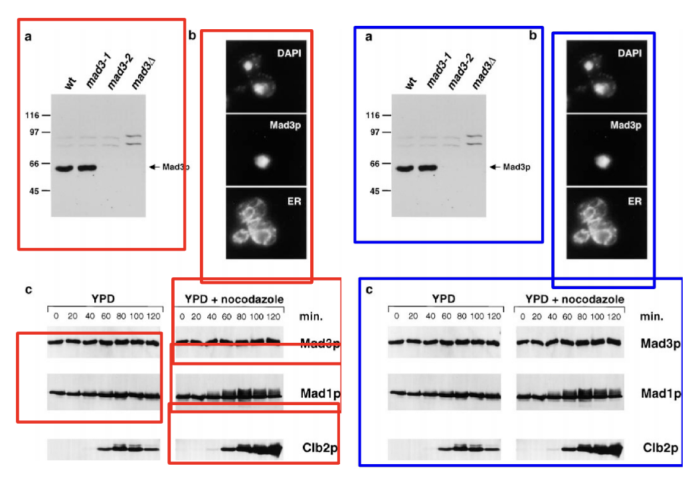

# Awesome Compound Figure Separation
A list of research papers on compound figure separation.

What is compound figure separation? Scientific figures often have many subplots or panels. Compound figure separation is the task of separating these subplots. This is important for enabling better indexing, retrieval, and analysis of scientific figures.  

## Demos

1. FigSplit demo [[Website](https://www.eecis.udel.edu/~compbio/FigSplit)]

## Datasets
1. ImageCLEF '13, '15, and '16 Compound Figure Separation Database [[2016 Paper](https://ceur-ws.org/Vol-1609/16090219.pdf)]. Labeled images in the '16 dataset: 8397
1. EXSCLAIM! Validation Dataset 2021 [[Website](https://acdc.alcf.anl.gov/mdf/detail/exclaim_validation_v1.1/)] [[Paper](https://doi.org/10.1109/ICIP42928.2021.9506171)]. Total labeled images: 100

## Papers (Chronological Order)

1. Yao, T. et al. (2022) ‘Compound Figure Separation of Biomedical Images: Mining Large Datasets for Self-supervised Learning’. Journal of Machine Learning for Biomedical Imaging. [[Paper](https://doi.org/10.48550/arXiv.2208.14357)] [[Code](https://github.com/hrlblab/ImageSeperation)]
2. Jiang, W., Schwenker, E., Spreadbury, T., et al. (2021) ‘A Two-stage Framework for Compound Figure Separation’, in 2021 IEEE International Conference on Image Processing (ICIP). [[Paper](https://doi.org/10.1109/ICIP42928.2021.9506171)] [[Code](https://github.com/MaterialEyes/exsclaim)]
3. Shi, X. et al. (2019) ‘Layout-aware Subfigure Decomposition for Complex Figures in the Biomedical Literature’, 2019 IEEE International Conference on Acoustics, Speech and Signal Processing (ICASSP) [[Paper](https://doi.org/10.1109/ICASSP.2019.8683824)]
4. Li, P. et al. (2018) ‘Compound image segmentation of published biomedical figures’, Bioinformatics. [[Paper](https://doi.org/10.1093/bioinformatics/btx611)] [[Website](https://www.eecis.udel.edu/~compbio/FigSplit)] [[Code](https://github.com/pengyuanli/FigSplit)]
5. Tsutsui, S. and Crandall, D. (2017) ‘A Data Driven Approach for Compound Figure Separation Using Convolutional Neural Networks’, in 2017 International Conference on Document Analysis and Recognition. [[Paper](https://doi.org/10.48550/arXiv.1703.05105)] [[Code](https://github.com/apple2373/figure-separator)]
6. Santosh, K.C., Antani, S. and Thoma, G. (2015) ‘Stitched Multipanel Biomedical Figure Separation’, in 2015 IEEE 28th International Symposium on Computer-Based Medical Systems. [[Paper](https://doi.org/10.1109/CBMS.2015.51)]
7. Lee, P.-S. and Howe, B. (2015) ‘Detecting and Dismantling Composite Visualizations in the Scientific Literature’, in ICPRAM 2015. [[Paper](https://doi.org/10.1007/978-3-319-27677-9_16)]
8. Cheng, B. et al. (2011) ‘Automatic segmentation of subfigure image panels for multimodal biomedical document retrieval’, in 18th Document Recognition and Retrieval Conference. [[Paper](https://doi.org/10.1117/12.873685)].